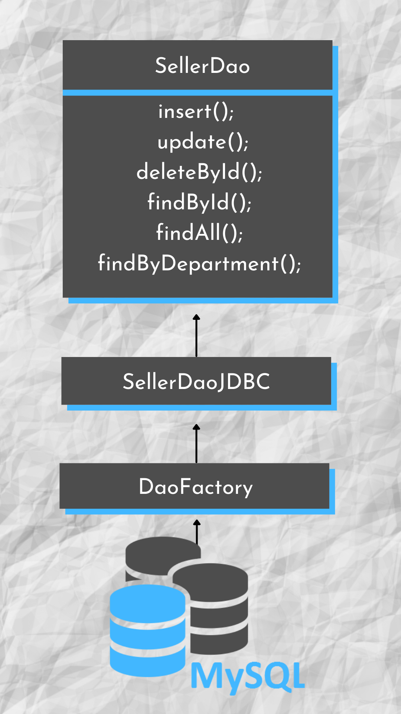

### Projeto com padrão DAO (Data Acess Object) usando MySQL como banco de dados, a partir do JDBC (Java Database Connectivity).
Nessa aplicação foi feito uma conexão ao banco de dados (MySQL), assim sendo possível acessar e alterar dados do banco de dados, por meio de uma interface, que neste caso é a SellerDao que contém métodos, como: inserir, deletar e buscar dados. Alguns são possíveis as mesmas funções porém espeficamente através de um id cadastrado no banco de dados.

## Como isso funciona? 

 

Referências
Professor Nelio Alves

Autor 
Gabriel Kruger 

